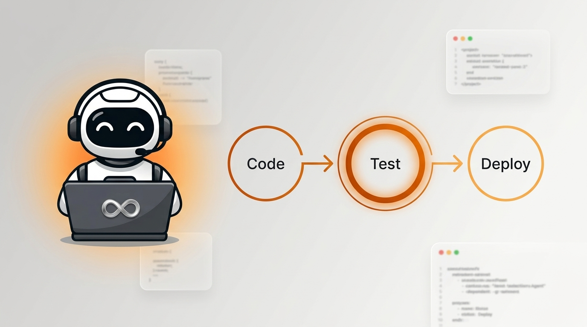

<p align="center">
  
</p>

# <p align="center">🤖 CI/CD Test Selection Agent 🤖</p>
### <p align="center">**Dynamically Prioritizes Automated Tests Using Reinforcement Learning to Minimize Time to First Failure**</p>

<p align="center">
  
  
  
  
  
  
</p>

---

## 🌟 Introduction

**CI/CD Test Selection Agent** is an intelligent, RL-powered system that replaces naive "run everything alphabetically" test execution with a smart agent that learns which tests to run first. By analyzing code changes, dependency graphs, and historical failure patterns, a trained **PPO (Proximal Policy Optimization)** agent dynamically reorders the test suite to surface failures as early as possible — minimizing **Time to First Failure (TTFF)** and accelerating developer feedback loops.

The system features:
1.  **Custom Gymnasium Environment**: A fully-compliant RL environment (`CITestEnvironment`) that models test selection as a sequential decision-making problem.
2.  **PPO Neural Network Agent**: Trained using Stable-Baselines3 to learn optimal test ordering policies from real test metadata and outcomes.
3.  **GitHub Actions Integration**: Ships as a reusable composite action — drop it into any repository's CI pipeline and let the agent take over test prioritization.
4.  **Comprehensive Evaluation Framework**: Benchmarks the RL agent against 5 baseline heuristic strategies with detailed comparison tables.

---

## ✨ Key Features

*   **🧠 Reinforcement Learning Core**: Uses PPO (Proximal Policy Optimization) to learn test ordering policies. The agent observes dependency signals, historical fail rates, and execution times to pick the next best test.

*   **🔍 Intelligent Change Analysis**: Diffs the current commit against the base commit to identify exactly which source files and functions changed — directly feeding the RL state.

*   **🌳 Dependency Graph Mapping**: Statically analyzes `import` statements to build a test → source dependency tree. Tests covering changed code are automatically prioritized.

*   **📊 Multi-Strategy Evaluation**: Every run benchmarks the RL agent against Alphabetical, Random, Cheapest-First, Historical Failure Rate, and Dependency-Based ordering — producing a side-by-side comparison table.

*   **⚡ Live Continuous Execution**: The live agent doesn't just rank tests — it executes them one-by-one in PPO-selected order, reporting pass/fail results in real time.

*   **🔄 Hard Fallback Safety Net**: If the agent fails or times out, the system automatically falls back to a standard `pytest -v` full-suite run — CI never breaks silently.

---

## 📐 System Architecture

*Every push moves through this pipeline. Each stage is a discrete, logged step that feeds into the next.*

<span style="color:#c2410c">#### `STAGE 1 · THE TRIGGER`</span>
### Git Push / Pull Request
A developer pushes code or opens a PR. GitHub Actions triggers the CI workflow.
> `Code changes` `New commits` `Modified source files` `Updated tests`

<div align="center"><span style="color:#c2410c">↓</span></div>

<span style="color:#2563eb">#### `STAGE 2 · FEATURE EXTRACTION`</span>
### Change & Dependency Analysis
The agent inspects the diff and maps the dependency graph to understand *what changed* and *which tests are affected*.
> `ChangeAnalyzer` `DependencyAnalyzer` `Git diff parsing` `AST import analysis`

<div align="center"><span style="color:#2563eb">↓</span></div>

<span style="color:#d97706">#### `STAGE 3 · STATE CONSTRUCTION`</span>
### RL State Builder
Constructs a feature matrix for each discovered test: `[is_dependent, fail_rate, avg_duration, is_executed]`.
> `StateBuilder` `TestDiscoverer` `Historical CSV data` `Live test metadata`

<div align="center"><span style="color:#d97706">↓</span></div>

<span style="color:#7c3aed">#### `STAGE 4 · THE AGENT`</span>
### PPO Test Selection Agent
*PPO — Schulman et al., 2017 (arXiv:1707.06347)*

The trained neural network observes the state matrix and selects the next test to execute. Every decision optimizes for early failure detection.

**`OBSERVE`** ➔ **`PREDICT`** ➔ **`EXECUTE`** ➔ **`UPDATE`**
> *A reward of `+B` for finding a failure, penalized by `-α × duration` for execution time. The loop continues until all tests are run.*

<div align="center"><span style="color:#7c3aed">↓</span></div>

<span style="color:#0891b2">#### `FABRICS`</span>

| 🔍 Feature Fabric | 🏋️ Training Fabric | 📏 Evaluation Fabric |
|:---|:---|:---|
| *Change & Dependency Analysis*<br><br>• Git diff → changed files & functions<br>• AST import → test↔source graph<br>• Historical CSV → fail rates & durations<br>• **Per-test feature vectors** | *Gymnasium + Stable-Baselines3*<br><br>• Custom `CITestEnvironment`<br>• PPO with `MlpPolicy`<br>• 5,000-step training episodes<br>• Saved `.zip` model checkpoints | *Multi-Strategy Benchmarking*<br><br>• TTFF (Time to First Failure)<br>• Tests-to-First-Fail count<br>• Feedback Time Saved (seconds)<br>• Side-by-side comparison table |

<div align="center"><span style="color:#0891b2">↓</span></div>

<span style="color:#dc2626">#### `STAGE 5 · LIVE EXECUTION`</span>
### Continuous Test Runner
Executes tests one-by-one in PPO-selected order. Reports ✅ PASS / ❌ FAIL with duration for each test. Exits with appropriate CI status code.
> `SingleTestRunner` `Real-time output` `CI status code` `Fallback safety net`

<div align="center"><span style="color:#dc2626">↓</span></div>

<span style="color:#4338ca">#### `STAGE 6 · CI VERDICT`</span>
### GitHub Actions Result
> `PASSED ✅` or `FAILED ❌` — with a full log of which tests ran, in what order, and how long each took.

<br>

> 🚀 **FASTER FEEDBACK, SMARTER CI**
> The agent learns to surface failures first — so developers know their code is broken in seconds, not minutes.

---

## 📂 Project Structure

```text
CI-CD-test-selection-agent/
├── src/                              # Core Agent & Pipeline Modules
│   ├── live_agent.py                 # 🤖 Live PPO agent — continuous test selection
│   ├── agents/
│   │   └── train_ppo.py              # PPO training loop & feature builder
│   ├── environment/
│   │   └── ci_env.py                 # Custom Gymnasium RL environment
│   ├── features/
│   │   ├── change_analyzer.py        # Git diff → changed files & functions
│   │   ├── dependency_analyzer.py    # AST import → test↔source graph
│   │   └── state_builder.py          # Constructs RL observation matrix
│   ├── runner/
│   │   ├── test_discovery.py         # Discovers pytest-compatible tests
│   │   └── test_runner.py            # Executes individual tests
│   ├── baselines/
│   │   └── heuristics.py             # 5 baseline ordering strategies
│   ├── evaluation/
│   │   └── evaluator.py              # TTFF benchmarking & comparison
│   ├── ci/
│   │   └── github_actions.py         # GitHub Actions context provider
│   └── data/
│       └── collect_history.py        # Historical test result collector
│
├── models/
│   └── ppo_ci_agent_v1.zip           # Pre-trained PPO model checkpoint
│
├── data/
│   ├── processed/                    # Generated test_history.csv
│   └── synthetic/
│       └── demo_repo/                # Sample repository for testing
│           ├── app/                   # Application source code
│           ├── test/                  # Test suite (pytest)
│           └── tests/                 # Additional test suite
│
├── .github/
│   └── workflows/
│       └── self-test.yml             # CI workflow — runs the agent on push/PR
│
├── main.py                           # Full 7-step pipeline runner
├── run_pipeline.py                   # Quick pipeline launcher
├── action.yml                        # Reusable GitHub Action definition
├── requirements.txt                  # Python dependencies
└── README.md                         # You are here
```

---

## 🛠️ Tech Stack

*   **RL Framework**: Stable-Baselines3 (PPO with `MlpPolicy`)
*   **Environment**: Gymnasium (custom `CITestEnvironment`)
*   **Deep Learning**: PyTorch (neural network backend)
*   **Data & Analysis**: Pandas, NumPy
*   **Version Control Analysis**: GitPython
*   **Test Execution**: pytest, pytest-json-report
*   **CI/CD**: GitHub Actions (composite action)

---

## 📊 Evaluation — Strategy Comparison

The agent is benchmarked against 5 baseline heuristics. The key metric is **TTFF** — how quickly a broken build is detected.

| Strategy | Description | Approach |
| :--- | :--- | :--- |
| **Alphabetical (Default)** | Standard pytest execution order. | Sort A → Z |
| **Random** | Random shuffle (seeded). | `random.shuffle()` |
| **Cheapest First** | Run fastest tests first. | Sort by `avg_duration` ↑ |
| **Historical Fail Rate** | Run flakiest tests first. | Sort by `fail_rate` ↓ |
| **Dependency Based** | Run tests covering changed code first. | Sort by `is_dependent` ↓ |
| **🤖 Trained RL Agent (PPO)** | Neural network selects optimal order. | PPO policy inference |

### Reward Function

The RL agent optimizes the following reward at each step:

```
R = (Failure Detected ? +B : 0) − (α × Execution Time)
```

| Symbol | Meaning | Default |
| :--- | :--- | :--- |
| `B` | Bonus for discovering a failure | `10.0` |
| `α` | Penalty multiplier for execution time | `1.0` |

---

## 🔄 Full Pipeline (7 Steps)

Running `python main.py` executes the complete pipeline:

| Step | Module | Description |
| :--- | :--- | :--- |
| **1** | `collect_history` | Collects historical test results into `test_history.csv` |
| **2** | `change_analyzer` | Diffs old → new commit, identifies changed files & functions |
| **3** | `dependency_analyzer` | Maps test → source import dependencies |
| **4** | `train_ppo` | Trains the PPO agent on live test features |
| **5** | `heuristics` | Generates 5 baseline ordering strategies |
| **6** | `evaluator` | Benchmarks all strategies, prints comparison table |
| **7** | `live_agent` | Runs the PPO agent in real-time test selection mode |

---

## ⚙️ Configuration & Environment Variables

| Variable | Description | Default |
| :--- | :--- | :--- |
| `TEST_REPO_PATH` | Path to the repository containing tests | `./data/synthetic/demo_repo` |
| `PYTHONPATH` | Must include both agent repo and test repo | Auto-configured |
| `PYTHONUNBUFFERED` | Flush output immediately (for CI logs) | `1` |
| `PYTHONIOENCODING` | UTF-8 encoding for emoji output on Windows | `utf-8` |

---

## 🏃 Setup & Execution

### 1. Clone & Install

```bash
git clone https://github.com/palriju11234-del/CI-CD-test-selection-agent.git
cd CI-CD-test-selection-agent
```

Set up a Python virtual environment:

```bash
python -m venv .venv

# Windows:
.\.venv\Scripts\activate

# macOS/Linux:
source .venv/bin/activate
```

Install dependencies:

```bash
pip install -r requirements.txt
pip install pytest pytest-json-report
```

### 2. Run the Full Pipeline

```bash
python main.py
```

This executes all 7 steps sequentially — from history collection through live agent execution.

### 3. Run the Live Agent Only

```bash
python src/live_agent.py
```

Runs the pre-trained PPO model directly on the test suite, selecting and executing tests in real time.

### 4. Quick Pipeline (Dependency Analysis + Live Agent)

```bash
python run_pipeline.py
```

### 5. Use as a GitHub Action

Add to any repository's workflow:

```yaml
name: Smart CI Tests
on: [push, pull_request]

jobs:
  test-selection:
    runs-on: ubuntu-latest
    steps:
      - uses: actions/checkout@v4
        with:
          fetch-depth: 2

      - uses: actions/setup-python@v5
        with:
          python-version: "3.11"

      - name: Run AI Test Selection Agent
        uses: palriju11234-del/CI-CD-test-selection-agent@main
```

---

## 🧪 Observation Space

Each test is represented as a 4-dimensional feature vector in the RL observation matrix:

| Index | Feature | Type | Description |
| :--- | :--- | :--- | :--- |
| 0 | `is_dependent` | `float` | `1.0` if the test imports changed source code, `0.0` otherwise |
| 1 | `fail_rate` | `float` | Historical failure rate from `test_history.csv` (0.0 – 1.0) |
| 2 | `avg_duration` | `float` | Average execution time in seconds |
| 3 | `is_executed` | `float` | `1.0` if already run this episode, `0.0` if pending |

**Observation shape**: `(num_tests, 4)` — a 2D matrix where each row is a test.

---

## 🛡️ License

Distributed under the MIT License.

---

<p align="center">Made with 🤖 by <strong>All Iz Well</strong></p>
